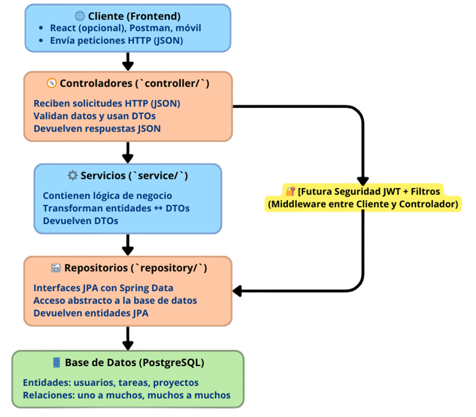

TeamFlow – Gestor de Proyectos con Equipos 🧩
=============================================


**TeamFlow** es una aplicación web que permite a los usuarios crear, organizar y colaborar en proyectos utilizando tableros tipo Kanban, al estilo de Trello. Diseñado como un proyecto educativo para desarrolladores junior, busca enseñar conceptos clave de desarrollo backend con Java y Spring Boot.

🎯 Objetivo
-----------
Crear una plataforma colaborativa donde los usuarios puedan:

- Gestionar múltiples proyectos
- Invitar miembros a colaborar
- Organizar tareas por estado (Por hacer, En progreso, Hecho)
- Asignar tareas a usuarios y dar seguimiento
- Comentar y visualizar actividad

Este proyecto sirve como entorno práctico para aprender:
- Spring Boot
- PostgreSQL
- JPA (Hibernate)
- Diseño de APIs RESTful
- Buenas prácticas de arquitectura

🛠️ Tecnologías
----------------
Backend:
- Java 17+
- Spring Boot
- Spring Web
- Spring Data JPA (Hibernate)
- PostgreSQL
- Maven

🗂️ Estructura del Proyecto
----------------------------
```
src/main/java/com/tuusuario/teamflow/
├── controller/       # API REST
├── service/          # Lógica de negocio
├── repository/       # Interfaces JPA
├── entity/           # Modelos persistentes
├── dto/              # Objetos de transferencia
├── config/           # Configuraciones generales
├── security/         # (próximamente) JWT, filtros
├── exceptions/       # Manejo de errores globales
└── TeamFlowApplication.java
```

📊 Diagrama de Arquitectura
----------------------------
Este diagrama muestra la arquitectura general de TeamFlow, basada en buenas prácticas de desarrollo backend con Java y Spring Boot. Se aplican principios como separación de responsabilidades, uso de DTOs, y una futura implementación de seguridad con JWT.



🔍 Descripción de cada componente
---------------------------------

| **Componente**     | **Rol en el sistema**                                                                 |
|--------------------|----------------------------------------------------------------------------------------|
| **Cliente**        | Puede ser Postman, un frontend en React o una app móvil. Realiza peticiones HTTP.     |
| **Controladores**  | Exponen los endpoints REST, validan la entrada y delegan a la capa de servicio.       |
| **Servicios**      | Contienen la lógica de negocio (reglas, validaciones, transformaciones).              |
| **Repositorios**   | Usan Spring Data JPA para abstraer el acceso a la base de datos.                      |
| **Base de datos**  | Almacena las entidades persistentes como usuarios, tareas, proyectos, etc.            |


📚 Entidades principales
-------------------------
User
- id: Long
- username: String
- email: String
- password: String
- Relaciones: proyectos, tareas, comentarios

Project
- id: Long
- name: String
- description: String
- owner: User
- members: List<User>
- boards: List<Board>

Board
- id: Long
- name: String ("Por hacer", "En progreso", "Hecho")
- project: Project
- tasks: List<Task>

Task
- id: Long
- title: String
- description: String
- assignedTo: User
- board: Board
- dueDate: Date
- priority: Enum (LOW, MEDIUM, HIGH)
- comments: List<Comment>

Comment
- id: Long
- task: Task
- author: User
- message: String
- createdAt: Date

🔐 Roles del sistema (versión futura)
-------------------------------------
- ADMIN: Creador del proyecto, controla todo
- MEMBER: Puede crear y editar tareas
- VIEWER: Solo lectura

🧪 Etapas de desarrollo (Roadmap)
----------------------------------
1. Versión 1:
   - CRUD de usuarios y proyectos sin autenticación
   - PostgreSQL configurado
   - API REST básica

2. Versión 2:
   - Relaciones entre usuarios, proyectos y tareas
   - Tableros estilo Kanban (backend)

3. Versión 3:
   - Seguridad con JWT y Spring Security
   - Roles por proyecto

4. Versión 4:
   - Comentarios, actividad, historial
   - Documentación con Swagger

5. Versión 5:
   - Deploy en Railway (backend) y Vercel (frontend)

📌 Funcionalidades por versión
-------------------------------
| Versión | Características principales                          |
|---------|------------------------------------------------------|
| 1.0     | CRUD de usuarios y proyectos                         |
| 2.0     | Tareas y tableros Kanban                             |
| 3.0     | Seguridad con JWT y control de roles                 |
| 4.0     | Comentarios, actividad, documentación Swagger        |
| 5.0     | Despliegue y mejoras visuales (opcional frontend)    |

🌐 Cómo ejecutar (versión inicial)
-----------------------------------
1. Clona el proyecto
   ```
   git clone https://github.com/tuusuario/teamflow.git
   ```
3. Configura la base de datos PostgreSQL en application.properties:
   ```
   spring.datasource.url=jdbc:postgresql://localhost:5432/teamflow
   spring.datasource.username=postgres
   spring.datasource.password=tu_password
   spring.jpa.hibernate.ddl-auto=update
   ```
   
5. Ejecuta la aplicación desde tu IDE o por consola:
   ```
   ./mvnw spring-boot:run
   ```
7. Accede al backend en:
   ```
   http://localhost:8080/api
   ```
📝 TODO
--------
- [x] CRUD de usuarios
- [x] Conexión a PostgreSQL
- [ ] Asociar usuarios a proyectos
- [ ] Implementar tableros Kanban
- [ ] Seguridad con JWT
- [ ] Comentarios en tareas
- [ ] Deploy en Railway / Vercel

🤝 Contribuciones
-----------------
¿Quieres contribuir a TeamFlow? ¡Genial! Sigue estos pasos:

1. Haz un fork del repositorio
2. Crea una nueva rama: git checkout -b feature/nueva-funcionalidad
3. Realiza tus cambios y haz commit: git commit -m "Añadir nueva funcionalidad"
4. Haz push a tu rama: git push origin feature/nueva-funcionalidad
5. Abre un Pull Request

Se agradecen contribuciones en código, pruebas, documentación o diseño 🎨

👤 Autor
--------
- Nombre: Walter AR
- GitHub: https://github.com/amnotwallas
- Proyecto creado como parte de mi formación como desarrollador backend con Java y Spring Boot.

> ¿Quieres colaborar o usar este proyecto como base para otro? ¡Estás invitado a forkearlo, mejorar y compartir! 💬
